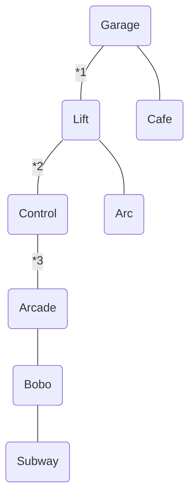

# DefCon 26 Badge Solution
This write up is an attempt to provide a *simple* walk through for those wanting to solve their own DefCon Badge or just understand the process. The write up is specific to the Human badge but can be applied to the other types with the understanding that the rooms and messages will be different but the puzzles are the same. For those who prefer the TLDR version the **steps needed to complete the badge are in bold.**


I'll try and stay out of the gritty details and tangents that were explored during the challenge. If you're interested in the lower layer findings I'd recommend checking out @wchill's [defcon26 badgehacking](https://github.com/wchill/defcon26_badgehacking) write up. 

I'm not going to go into detail about how to flash your badge with the latest firmware but I have included the [firmware image](resources/Tymkrs_DC26-V2.hex) in the repo along with the [Toymakers notes](resources/Reflashing_The_Badge.docx?raw=True) on how to flash the badges. 

Once flashing is complete, you should have the following starting state:

```diff
+ D
- E
! F
- C
! O
- N
```

In total there are eight puzzles that need to be solved, one for each room. Four of them hardware puzzles and four in software.

To help understand what has to been done and still needs to be completed each room has up to four messages that can be shown. 

 - A general description of the room
 - A message indicating puzzle state of that room
 - The status of the switch in the room
 - A karma message from pairing 

With the exception of the description, each line has a good value (I refer to this as 1) and a bad value (0). The karma message is based on the karma of the *other* badge after pairing. Each badge type is associated with a room. 
At end game we'll have all the puzzles completed and each room's karma in their good state. [This table](badge_table.md) lists the short name for each room along with all possible messages and the matching badge type.

## Software Puzzles 1, 2, & 3
The first thing that needs to be done is to get your own karma score green. To do this we need to get at least 2 green letters and 2 yellow. From the starting state that means we only need to change one red letter to yellow. We can do this by **hitting the switch in the ARC room**. That will change the C from red to yellow. However, to get down there we need to punch out which turns our D red from green. To remedy this we'll just punch back in after changing the C to yellow in the ARC room. Upon Turning the D green you also see the N switch to green as well. This indicates we're in good karma and when we pair with others they'll get the good karma message for our badge type (Human). At this point guards (red figures) are hostile and if you are in the same location with one for too long they'll reset you back to the top. This gets annoying so we'll adress it quick.

Ideally, you'd then go help others of each badge type achieve a good karma and then pair with them. This would have been an interesting dynamic during the conference but there was a bug in the pairing which only allowed bad karma pairings and so by pairing during the conference players were actually getting further away from their goal. It wasn't until the last day of the conference that this bug was fixed. Around that same time the protocol used during the pair was reversed and by hooking your badge to an Arduino you could simulate pairing with all the devices and cut out a lot of leg work. Since the conference is now over and I didn't have access to all badge types this is the route I went. There are multiple releases of the badge pairing simulator but not all of them capture a good karma pairing. The version I am using I obtained during the conference from Glen Anderson. You can pull down the sketch from http://mactcp.net/defcon26badge.html. With permission I've also included it in this repo. It was written for a Pro Micro but should work on any Arduino device with 2 serial ports, I used a Due. 

|Badge Pins (Top down)| Arduino Pin|
|--|--|
|TX|RX1|
|GND|GND|
|GND|GND|
|RX|TX1|

Once connected the Arduino will detect the badge and starting **pairing as all badge types with good karma**.

After this completes we'll have a lot more progress in the game. For starters this will give us the good karma line in each room. But it also solves a number of room puzzles. After pairing with each badge type (*karma doesn't matter*) the Garage puzzle is marked complete.

Good karma in the cafe gives the message `The shop owner notices you're hungry and gives you extra broth to take home.` which solves the Lift puzzle `You pour ramen broth in the coinhole & can buy anything in the vending machine!`. Good kara in Bobo's room gives the message `You see a worker back from break, "Vending machine's selling lockpick kits!"` which, with the lift puzzle solved completes the Control room puzzle. This allows us to move from room to room without taking out our punch card.

This leaves 5 rooms left to be solved. Cafe, ARC, Arcade, Bobo, and the Subway.

## Hardware Puzzle 1 (Hall sensor)
The Subway is the easiest of these. There's simply a hall sensor behind it. **Place a magnet behind the Subway** underneath the battery and you'll see the subway light up.


## Hardware Puzzle 2 (Blinky)
The second hardware puzzle is the ARC. If you notice the puzzle message in the ARC room it mentions a light blinking insistently. This is referring to the blinking yellow light right next to the room. The message in the cafe is a hint how: `Short steps!..2!..3!`  The other badges have similar references:
 - `Bones 2 and 3 are connected by a bridge`
 - `connect bases 2 and 3, it'll change`
 - `You hear a rumor that there are two shortcuts`
 
These are all hinting at the fact you need to **short pins 2 & 3 of U5** (see image). Doing so will stop the blinking, solve the Arc room puzzle and turn the E green. We also could have done this puzzle first which, would be enough to make your karma green. Had things been different, this could have been an easy method to get other badges karma up for pairing during the conference.


## Hardware Puzzle 3 (Sneak)
Next up, Bobo. The a pretty clear message in this room `A paper tape is draped into the machine: "0xFEED B0B0 DEAD BEEF"` The question we were all wondering was how. Turns out we couldn't until the most recent patch.  With the latest firmware if you go into the arcade or control room and start mashing buttons you'll notice Bobo's head change state. From here we can send binary data to Bobo. We just need to **key in the binary value of 0xFEEDB0B0DEADBEEF**. This can be done via the Serial terminal use the '-' & '+' keys. For some reason Bobo expects the sequence reversed. *The reverse of this string is not little endian*.  The following python code can generate the sequence needed.  Simple copy and paste this into the terminal and you will have awaken Bobo. If you have done it correctly the message in Bobo's room will read `Your actions fed the paper tape into the machine. The guards are all on alert!`

```python
''.join(['+' if x=='1' else '-' for x in bin(0xFEEDB0B0DEADBEEF)[2:]])[::-1]
```

`++++-+++-+++++-++-++-+-+-++++-++----++-+----++-++-++-+++-+++++++`

So how is this a hardware challenge? It has to do with the chip next to Bobo (U4).  This chip behaves like and AND gate. That is, until it receives this sequence of binary data, it then changes its behavior to an XOR gate. Apparently, this practice of an IC pretending to be a different chip but then having a secret back door is known as a 'sneak' chip.

At this point we have what we need to turn the O green and have an all green board.  Simply make sure to have the switch in bobo room, the ARC, and the cafe all on. 

## Hardware Puzzle 4 (DIP Flip)
There are however some pieces still unsolved, namely the Cafe and the Arcade. In the arcade there are two hex strings shown `0x2BFC8E2B3561C04FBBC73FA43D5D96540D0AA008B30924CE47DA0EC67530D3` and `0x536E65616B20466972737420466C6970205365636F6E64`. The first we will get back to later. The second is simple an ascii string `Sneak First Flip Second`. This is a hint at what we need to do to solve the Cafe room. Here are a few more hints"
 - `The corner tv glitches an old workout show, "Turn 180, squat - you're on fire!"`
 - `Using zoom and rotate magic`
 - `From one angle, there're 64 colors, and from another, 8!`
 - `about perspective. If you turn 180, you'll have a new one!`

Embedded in a service menu there is another string will explains what these refer to `Check POC||GTFO 17!`

[On page 32](https://www.alchemistowl.org/pocorgtfo/pocorgtfo17.pdf#page=32) of that issue is an article by Joe Grand (*which was inspired by @Whixr*) describing a circuit where and IC can function in either orientation.  Thus, if we **desolder U7 and flip it around** it behaves differently (*The chip performs LFSR 64 normally and LFSR 8 when rotated*). Doing so completes the Cafe puzzle.
**Note: Remember to pull power from the badge before desoldering this chip!**


*Please ignore the scaring around the chip. Over the conference I flipped that chip more times than I can remember.  At least one of which took place in the massively crowded halls at DefCon.*

## Software Puzzle 4 (Secret)
Last is the finally room, The Arcade. Now, with the correct decoder in place and Bobo enable we can decode the final message (the `0x2BFC8E2B3561C04FBBC73FA43D5D96540D0AA008B30924CE47DA0EC67530D3` string we mentioned earlier). To do this go back to the arcade room and **feed this sequence to Bobo**.  It works best if you reset the badge and reenable Bobo by sending him the feed string again first. This puts the decoder in the correct state to decode the string.  It is import and that we don't send any other characters to Bobo before hand or our decoder will be out of sync and the message won't decode. We will simply pass that string to Bobo, with two zeros prepended to make it an even 32 bytes. The following python code will generate the output for us.

```python
ciphertext_num = 0x2BFC8E2B3561C04FBBC73FA43D5D96540D0AA008B30924CE47DA0EC67530D3
ciphertext_bits = '00' + format(ciphertext_num, "0b")
''.join(['+' if x=='1' else '-' for x in ciphertext_bits])
```

`--+-+-++++++++--+---+++---+-+-++--++-+-+-++----+++-------+--+++++-+++-++++---+++--+++++++-+--+----++++-+-+-+++-++--+-++--+-+-+------++-+----+-+-+-+---------+---+-++--++----+--+--+--+--++--+++--+---+++++-++-+-----+++-++---++--+++-+-+--++----++-+--++`

If done correctly the finally message in the Arcade will show `You've figured out the secret to life!`. As you may have guessed, this is a Hitchhiker's Guide to the Galaxy reference. The seed that is used by the LSFR 8 decode is 0x42. FYI: It isn't displayed anywhere but when the hex string is decoded the result is `Tymkrs + Wire + Ninja wuz here!`

Many thanks go out to @Tymkrs, @wchill, @raldi, @gl3n, @zevlag, @negative_alpha and others who helped put all the pieces together.


1. You must be punched in (Garage switch 0) or Control puzzle solved to go from Garage to Lift
	Lift switch must be 1 to go up to Garage room
2. Lift switch must be 0 to go down to Control room
3. Arc switch must be 1 to go below Control room
